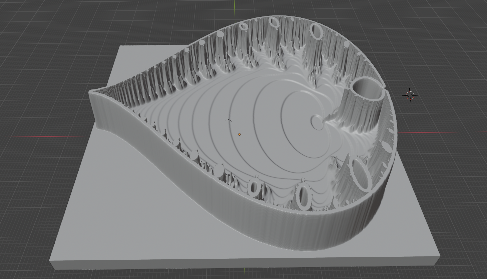
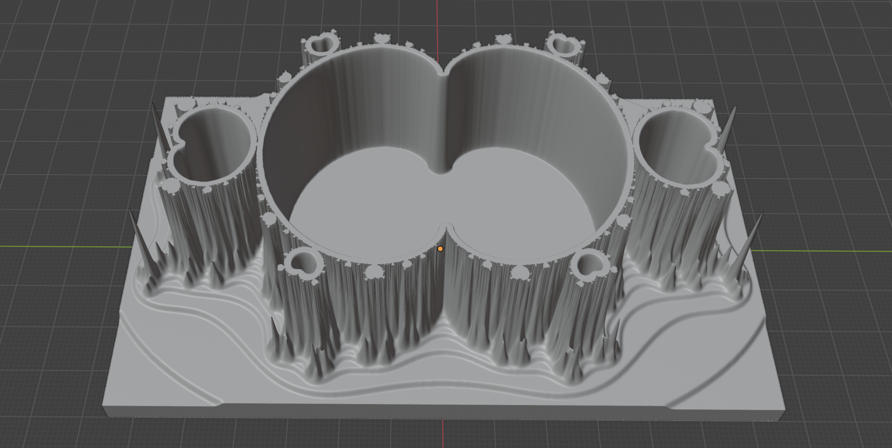
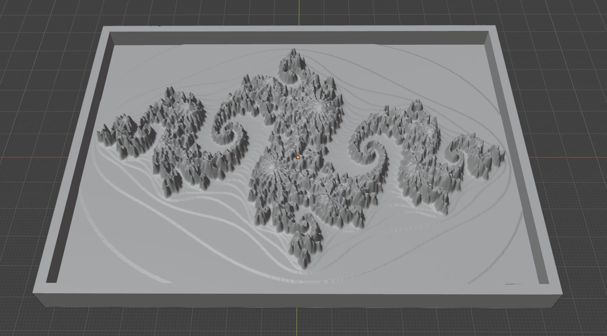

# Chisel3d
3D libs and code to build 3D printable / CNC cutable objects.

(C) 2024 Ben Clewett & Code Critical Ltd

Licenced under <a href="https://www.gnu.org/licenses/gpl-3.0.en.html">GPL 3.0</a>

# Examples of Fractal's

## Whole Fractal

<pre>
Config.Fractal.Model.MAX_ITERATIONS=400
Config.Fractal.Model.I0=-2.1
Config.Fractal.Model.I1=0.9
Config.Fractal.Model.J0=-1.3
Config.Fractal.Model.J1=1.3
</pre>

<a href="https://www.thingiverse.com/thing:6498451">thingiverse.com</a>

## Seahorse

<pre>
Config.Fractal.Model.MAX_ITERATIONS=400
Config.Fractal.Model.I0=-0.7513
Config.Fractal.Model.I1=-0.7413
Config.Fractal.Model.J0=0.1050
Config.Fractal.Model.J1=0.1146
</pre>

<a href="https://www.thingiverse.com/thing:6500804">thingiverse.com</a>

## Spiral

<pre>
Config.Fractal.Model.MAX_ITERATIONS=4000
Config.Fractal.Model.I0=-0.7458547
Config.Fractal.Model.I1=-0.7412791
Config.Fractal.Model.J0=0.1291145
Config.Fractal.Model.J1=0.1336901
</pre>

<a href="https://www.thingiverse.com/thing:6500841">thingiverse.com</a>

## Valley of the Seahorses

<pre>
Config.Fractal.Model.MAX_ITERATIONS=8000
Config.Fractal.Model.I0=-0.73857486
Config.Fractal.Model.I1=-0.73857469
Config.Fractal.Model.J0=0.1753608767
Config.Fractal.Model.J1=0.1753610113
</pre>

<a href="https://www.thingiverse.com/thing:6498625">thingiverse.com</a>

## Fractal Castle

<pre>
Config.Fractal.Model.I0=-1.940982879244
Config.Fractal.Model.I1=-1.940982878940
Config.Fractal.Model.J0=0.0006481238065
Config.Fractal.Model.J1=0.0006481240343
</pre>

## Mandelbrot Boss

<pre>
Config.Fractal.Model.MAX_ITERATIONS=4000
Config.Fractal.Model.I0=-1.2572854149705
Config.Fractal.Model.I1=-1.2572854081395
Config.Fractal.Model.J0=0.0382804994950
Config.Fractal.Model.J1=0.0382805062089
</pre>

## Mandelbrot in Polar Coordinates

<pre>
Config.Fractal.Model.MAX_ITERATIONS=500
Config.Fractal.Model.I0=-1
Config.Fractal.Model.I1=1
Config.Fractal.Model.J0=0.2
Config.Fractal.Model.J1=2.1
Config.Fractal.Model.POLAR_COORDINATES=true
</pre>

## Mandelbrot Insideout

<pre>
Config.Fractal.Model.MAX_ITERATIONS=500
Config.Fractal.Model.I0=-1.15
Config.Fractal.Model.I1=3.75
Config.Fractal.Model.J0=-1.35
Config.Fractal.Model.J1=1.35
Config.Fractal.Model.INSIDE_OUT=true
</pre>

## Mandelbrot Shelf

<pre>
Config.Fractal.Model.MAX_ITERATIONS=500
Config.Fractal.Model.I0=-3
Config.Fractal.Model.I1=3.021
Config.Fractal.Model.J0=0
Config.Fractal.Model.J1=4
Config.Fractal.Model.POLAR_COORDINATES=true
Config.Fractal.Model.INSIDE_OUT=true
</pre>

## Mandelbrot Cubed

<pre>
Config.Fractal.Model.MAX_ITERATIONS=500
Config.Fractal.Model.I0=-1.15
Config.Fractal.Model.I1=3.75
Config.Fractal.Model.J0=-1.35
Config.Fractal.Model.J1=1.35
</pre>

## Mandelbrot Buddha

<pre>
Config.Fractal.Model.MAX_ITERATIONS=400
Config.Fractal.Model.I0=-1.7
Config.Fractal.Model.I1=0.7
Config.Fractal.Model.J0=0.99
Config.Fractal.Model.J1=-0.99
</pre>

## Mandelbrot Bowl

<pre>
Config.Fractal.Model.MAX_ITERATIONS=400
Config.Fractal.Model.I0=-1.5
Config.Fractal.Model.I1=0.7
Config.Fractal.Model.J0=1
Config.Fractal.Model.J1=-1
Config.Fractal.Processing.PROJECT_CENTRE_SPHERE=10,0,-50
</pre>

## Mandelbrot Ridge Crossing

<pre>
Config.Fractal.Model.MAX_ITERATIONS=4000
Config.Fractal.Model.I0=-1.5554762330030398
Config.Fractal.Model.I1=-1.555476232994389
Config.Fractal.Model.J0=0.0000000000031651
Config.Fractal.Model.J1=-0.0000000000033231
</pre>

## Julia Set

<pre>
Config.Fractal.JuliaSet.RC=-0.8
Config.Fractal.JuliaSet.IC=0.156
</pre>

## Mandelbrot Tricorn

<pre>
Config.Fractal.Model.MAX_ITERATIONS=400
Config.Fractal.Model.I0=-2.1
Config.Fractal.Model.I1=2.1
Config.Fractal.Model.J0=-2.1
Config.Fractal.Model.J1=2.1
</pre>

## Mandelbrot Rising

<pre>
Config.StlPrint.BLOCK_SIZE_3D = .3
Config.StlPrint.Settings3D.TILT_DEGREES_IN_Y=45
Config.StlPrint.Settings3D.TILT_DEGREES_IN_X=0
Config.StlPrint.Settings3D.TILT_DEGREES_IN_Z=0
Config.StlPrint.Settings3D.MODEL_MOVE=0,0,30
Config.StlPrint.Settings3D.SHADOW=true
Config.StlPrint.Settings3D.SHADOW_Z=0
Config.StlPrint.Settings3D.SHADOW_DEPTH=2
Config.Fractal.Model.MAX_ITERATIONS=400
Config.Fractal.Model.I0=-2.1
Config.Fractal.Model.I1=0.5
Config.Fractal.Model.J0=-1
Config.Fractal.Model.J1=1
Config.Fractal.Model.K0 = 1.1
Config.Fractal.Model.K1 = -1.1
</pre>

## Classic Burning Ship

<pre>
Config.Fractal.Model.MAX_ITERATIONS=500
Config.Fractal.Model.I0=-1.8
Config.Fractal.Model.I1=-1.7
Config.Fractal.Model.J0=-0.08
Config.Fractal.Model.J1=0.01
</pre>

## Infinite Machine

Production of fractal structures.  With the help of Blender, images like this may be produced.

## Gravitational Waves

