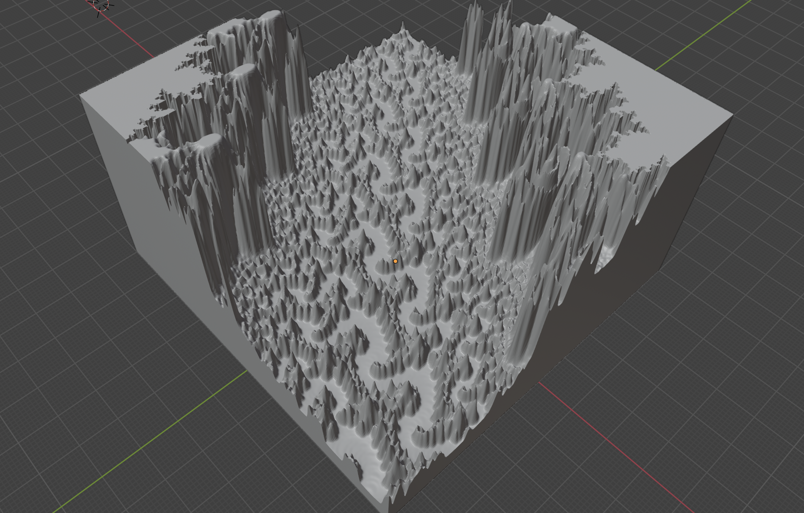

# Chisel3d
3D libs and code to build 3D printable / CNC cutable objects.

(C) 2024 Ben Clewett & Code Critical Ltd

Licenced under <a href="https://www.gnu.org/licenses/gpl-3.0.en.html">GPL 3.0</a>

# Examples of Mandelbrot's

## Whole Mandelbrot

<pre>
Config.Mandelbrot.Model.MAX_ITERATIONS=400
Config.Mandelbrot.Model.I0=-2.1
Config.Mandelbrot.Model.I1=0.9
Config.Mandelbrot.Model.J0=-1.3
Config.Mandelbrot.Model.J1=1.3
</pre>

<a href="https://www.thingiverse.com/thing:6498451">thingiverse.com</a>

## Seahorse

<pre>
Config.Mandelbrot.Model.MAX_ITERATIONS=400
Config.Mandelbrot.Model.I0=-0.7513
Config.Mandelbrot.Model.I1=-0.7413
Config.Mandelbrot.Model.J0=0.1050
Config.Mandelbrot.Model.J1=0.1146
</pre>

<a href="https://www.thingiverse.com/thing:6500804">thingiverse.com</a>

## Spiral

<pre>
Config.Mandelbrot.Model.MAX_ITERATIONS=4000
Config.Mandelbrot.Model.I0=-0.7458547
Config.Mandelbrot.Model.I1=-0.7412791
Config.Mandelbrot.Model.J0=0.1291145
Config.Mandelbrot.Model.J1=0.1336901
</pre>

## Valley

<pre>
Config.Mandelbrot.Model.MAX_ITERATIONS=8000
Config.Mandelbrot.Model.I0=-0.73857486
Config.Mandelbrot.Model.I1=-0.73857469
Config.Mandelbrot.Model.J0=0.1753608767
Config.Mandelbrot.Model.J1=0.1753610113
</pre>

<a href="https://www.thingiverse.com/thing:6498625">thingiverse.com</a>

## Infinite Machine

Production of fractal structures.  With the help of Blender, images like this may be produced.

